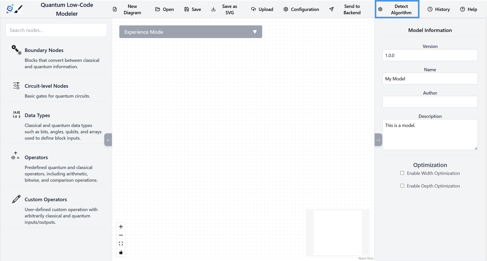
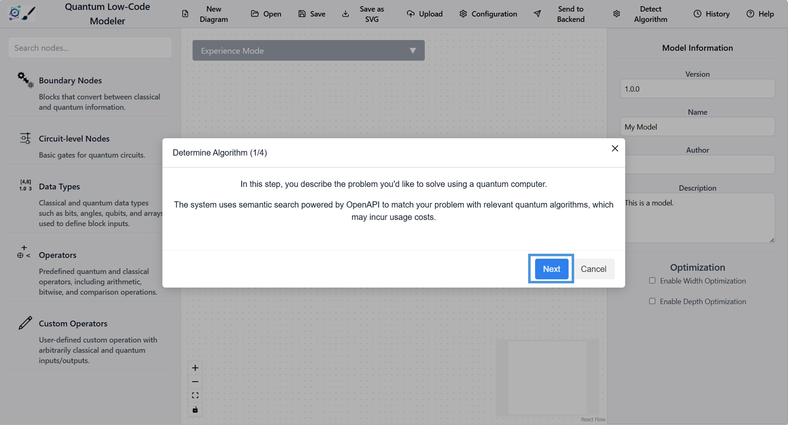
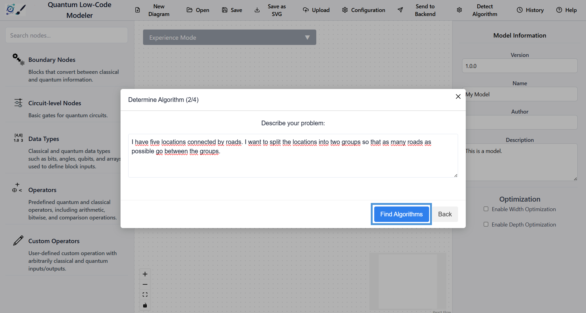
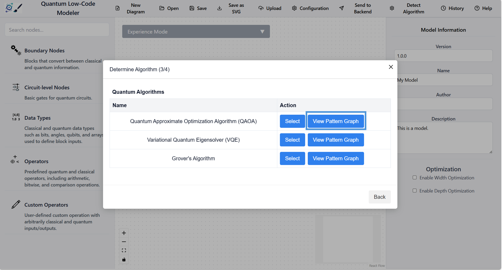
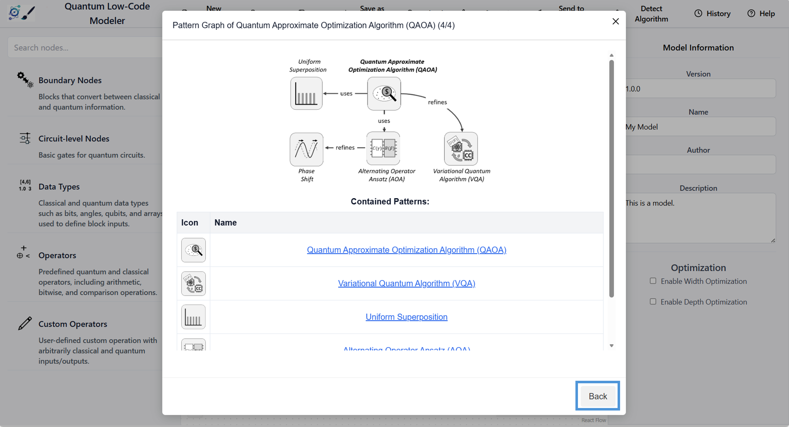
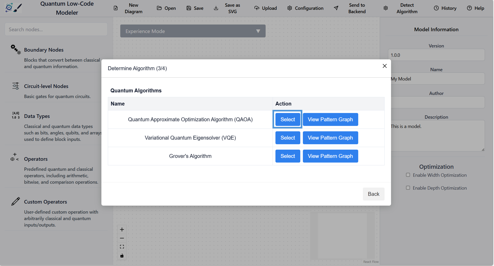
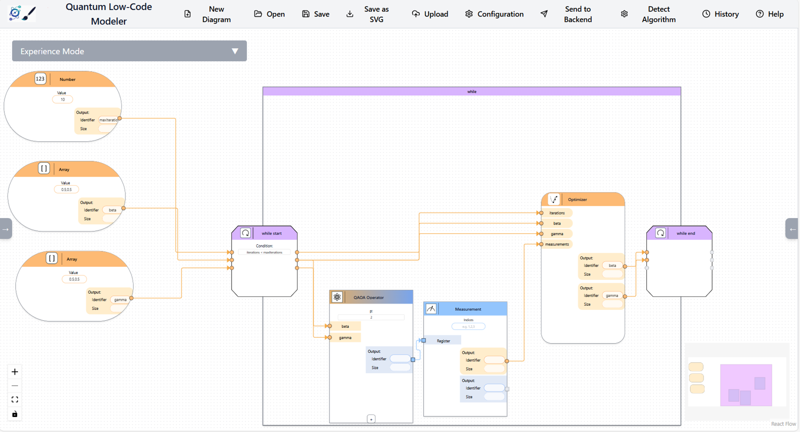
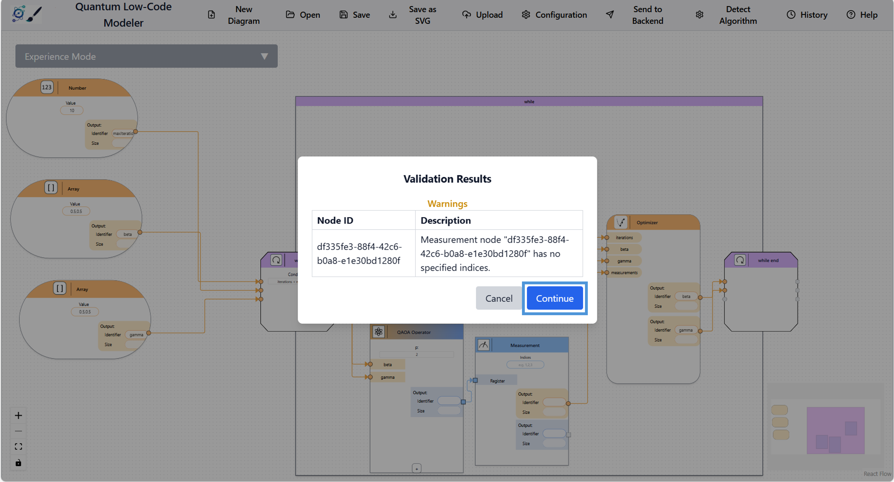
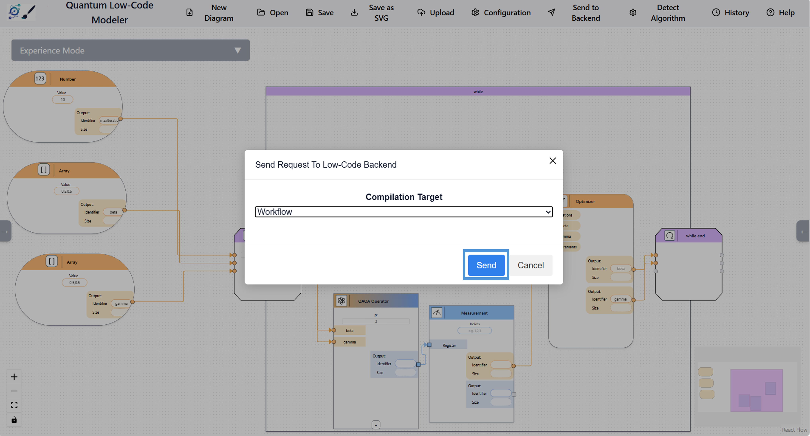
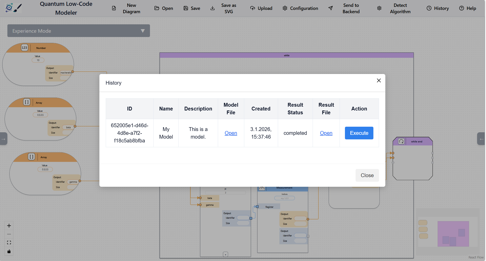

# CLOSER 2026

A video showcasing the described use case is available on YouTube:

[

## Data Type Nodes

#### Classical Data Types

| Block               | Properties | Description                                    |
| ------------------- | ---------- | ---------------------------------------------- |
| **Binary Type**     | `value`    | Bit or Boolean value.                          |
| **Numeric Type**    | `value`    | Integer or floating-point value.               |
| **Physical Type**   | `value`    | Physical quantities such as duration or angle. |
| **Collection Type** | `value`    | A list of values, possibly of varying length.  |


#### Quantum Data Types
| Block       | Properties | Description                                            |
| ----------- | ---------- | ------------------------------------------------------ |
| **Qubit**   | `value`    | Basic unit of quantum information.                     |
| **Ancilla** | `value`    | Auxiliary qubit used temporarily during a computation. |


---
## Boundary Nodes

| Block            | Properties                              | Description                                               |
| ---------------- | --------------------------------------- | --------------------------------------------------------- |
| **EncodeValue**  | `encodingType`, `bound` | Encodes a classical value into a quantum state.           |
| **PrepareState** | `quantumStateName`      | Generates a predefined quantum state such as Bell or GHZ. |
| **Measurement**  | `measurementBasis`, `qubitSelection`    | Measures selected qubits to produce classical output.     |

---

## Operators

| Block                   | Properties  | Description                                                               |
| ----------------------- | ----------- | ------------------------------------------------------------------------- |
| **ArithmeticOperation** | `operation` | Performs arithmetic operations (add, subtract, multiply, divide, modulo). |
| **BitwiseOperation**    | `operation` | Performs bitwise operations (and, or, xor, not).                          |
| **ComparisonOperation** | `operation` | Compares values (equality, inequality, ordering).                         |
| **MinMax**              | `operation` | Selects minimum or maximum based on the chosen operation.                 |
| **CustomNode** | `classicalInputs`, `quantumInputs`, `classicalOutputs`, `quantumOutputs` | User-defined node with custom classical and quantum interfaces. |

---


## Control Structure Nodes

| Block            | Properties  | Description                                               |
| ---------------- | ----------- | --------------------------------------------------------- |
| **If** | `condition` | Conditional block that branches based on a boolean input. |
| **While**        | `condition` | Repeats a block of operations while a condition is true.  |

---

## Circuit Nodes

| Block             | Properties  | Description                                         |           
| ----------------- | ----------- | --------------------------------------------------- | 
| **Qubit Circuit** | -           | Represents a single qubit used in the circuit.      |           
| **H**             | -           | Hadamard gate: puts a qubit into superposition.     |           
| **RX(θ)**         | `parameterType` | Rotates qubit around X-axis by θ radians.           |           
| **RY(θ)**         | `parameterType` | Rotates qubit around Y-axis by θ radians.           |           
| **RZ(θ)**         | `parameterType` | Rotates qubit around Z-axis by θ radians.           |           
| **T**             | -           | T gate: a π/4 phase shift.                          |           
| **X**             | -           | Pauli-X gate: flips the state (like a NOT gate).    |           
| **Y**             | -           | Pauli-Y gate: flips and phases the qubit state.     |           
| **Z**             | -           | Pauli-Z gate: adds a π phase shift to               |  
| **S**             | -           | S gate: a π/2 phase shift.                          |           
| **SX**            | -           | Square root of X gate (√X).                         |           
| **SDG**           | -           | S† gate: inverse of the S gate.                     |           
| **TDG**           | -           | T† gate: inverse of the T gate.                     |           
| **CNOT**          | -           | Controlled-X gate: flips target qubit if control is |       
| **SWAP**          | -           | Swaps the states of two qubits.                     |           
| **CY**            | -           | Controlled-Y gate.                                  |           
| **CZ**            | -           | Controlled-Z gate.                                  |           
| **CH**            | -           | Controlled-Hadamard gate.                           |           
| **CRX(θ)**        | `parameterType` | Controlled rotation by θ around X-axis.             |          
| **CRY(θ)**        | `parameterType` | Controlled rotation by θ around Y-axis.             |           
| **CRZ(θ)**        | `parameterType` | Controlled rotation by θ around Z-axis.             |           
| **Toffoli**       | -           | CCNOT: flips target if both controls are            |      
| **CSWAP**         | -           | Controlled SWAP: swaps two qubits if control is     |       
| **Splitter**      |    `output-count`        | Splits a quantum register into individual qubits.   |           
| **Merger**        | `input-count`           | Merges multiple qubits into one register.           |           


---

## Setup

This guide explains how to deploy the Quantum Low-Code Modeler using Docker and run a QAOA-based workflow.

All required components are provided as Docker containers and started using the supplied `docker-compose` file.

---

## 1. Prepare the Environment

Open the `docker` directory and update the `.env` file:

```
PUBLIC_HOSTNAME=<your-public-ip>
```

Important: Use a publicly reachable IP address. Do not use `localhost`.

---

## 2. Start the Components

Run the following commands from the `docker` directory:

```
docker-compose pull
docker-compose up --build
```

Wait until all containers are running. This may take several minutes.

---

## 3. Open the Modeler

Open the following URL:

http://localhost:4242

You should see the Modeler start screen:



The Modeler is pre-configured with:

- endpoints for the low-code backend  
- OpenTOSCA ecosystem workflow  
- QRM repository  

Open the Configuration menu in the toolbar and enter your OpenAI token.

---

## 4. Select an Algorithm

Open the Algorithm Selection view:



Read the information provided:



Enter the following problem description:

```
I have five locations connected by roads. I want to split the locations into two groups so that as many roads as possible go between the groups.
```



Continue to the next step.

---

## 5. Inspect the Pattern Graph

Click on "Pattern Graph":



Scroll to review the listed components and information, then return using the Back button.

---

## 6. Select the Template

Click on "Select Template":



Select the QAOA template.

This template is also available as `docs/model.json`.



---

## 7. Transform the Model

Click on "Transform Model":


A validation warning may appear:



This warning is expected. QAOA automatically adapts to the number of nodes, and the backend configures measurement of all qubits, so no manual specification is required.

---

## 8. Select and Deploy the Workflow

Select a workflow:



Go to History. The top entry is the most recent transformation.

Click on Deploy:



Deployment may take some time.

---

## 9. Execute the Workflow in Camunda

Open:

http://localhost:8090

Log in using the following credentials:

```
user: demo
password: demo
```

Open the Tasklist, select the process, and enter your IP address:


Click Run.

---

## 10. View the Result

Open the Camunda Cockpit.

The result includes the objective function value. In this example, the value is:

```
5
```

---


## Disclaimer of Warranty
Unless required by applicable law or agreed to in writing, Licensor provides the Work (and each Contributor provides its Contributions) on an "AS IS" BASIS, WITHOUT WARRANTIES OR CONDITIONS OF ANY KIND, either express or implied, including, without limitation, any warranties or conditions of TITLE, NON-INFRINGEMENT, MERCHANTABILITY, or FITNESS FOR A PARTICULAR PURPOSE. You are solely responsible for determining the appropriateness of using or redistributing the Work and assume any risks associated with Your exercise of permissions under this License.

## Haftungsausschluss
Dies ist ein Forschungsprototyp. Die Haftung für entgangenen Gewinn, Produktionsausfall, Betriebsunterbrechung, entgangene Nutzungen, Verlust von Daten und Informationen, Finanzierungsaufwendungen sowie sonstige Vermögens- und Folgeschäden ist, außer in Fällen von grober Fahrlässigkeit, Vorsatz und Personenschäden, ausgeschlossen.
