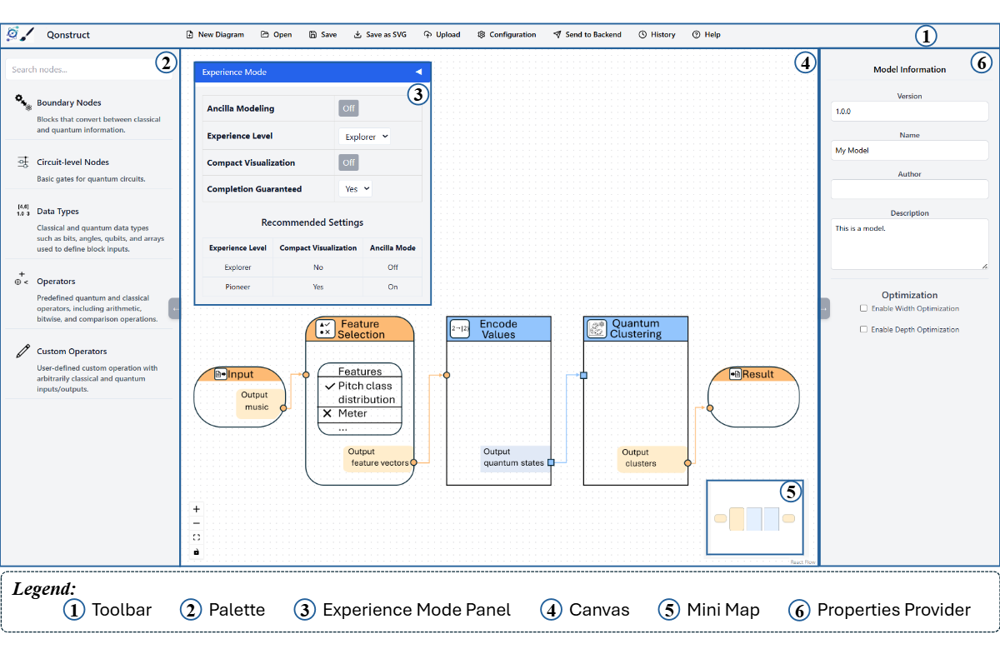

# CLOSER 2026

The use case utilizes the following components:

* [Quantum Low-Code Modeler](https://github.com/AnonymousUserAccount958/low-code-modeler): A graphical BPMN modeler to define, transform, and deploy quantum workflows.
* [Low-Code Model Transformation Backend](https://github.com/AnonymousUserAccount958/leqo-backend): A microservice ecosystem enabling a service-based execution of quantum algorithms.
* [Camunda BPMN Engine](https://camunda.com/products/camunda-platform/bpmn-engine/): A state-of-the-art BPMN workflow engine used to execute quantum workflows after transforming them to native BPMN workflow models to avoid the need for extending the workflow engine.
* [Winery](https://github.com/OpenTOSCA/winery): Winery is a web-based environment to graphically model TOSCA-based deployment models, which can then be attached to activities of quantum workflows to enable their automated deployment in the target environment.
* [OpenTOSCA Container](https://github.com/OpenTOSCA/container): A TOSCA-compliant deployment system to deploy and manage applications or services.
* [Pattern Atlas](https://github.com/OpenTOSCA/container)


## Setup

To set up the required components for the use case, a machine with a publicly accessible IP is required, e.g., hosted in the cloud.
All components are available via Docker.
Therefore, these components can be started using the Docker-Compose file available [here](./docker):

1. Update the [.env](./docker/.env) file with your settings:
  * ``PUBLIC_HOSTNAME``: Enter the publicly accessible IP address of your Docker engine. Do *not* use ``localhost``.

2. Run the Docker-Compose file:
```
docker-compose pull
docker-compose up --build
```

3. Wait until all containers are up and running. This may take some minutes.

Open the Quantum Low-Code Modeler using the following URL: [localhost:4242](http://localhost:4242)

Afterward, the following screen should be displayed:



Open the example model available [here](docs/Model.json) using the Quantum Low-Code Modeler.
For this, click on ``Open`` in the top-left corner, and afterward, select the model.
Then, the following model is displayed:

The Quantum Low-Code Modeler is pre-configured with the endpoints of the low-code backend, the OpenTOSCA ecosystem workflow and the QRM repository.
To check these settings, click on ``Configuration`` in the toolbar, opening the config pop-up:


Please verify that the different configuration properties are set to the following values.
Thereby, $IP has to be replaced with the IP address of the Docker engine used for the setup described above:

* Under ``General``:
    * ``Camunda Engine Endpoint``: http://$IP:8090/engine-rest
* Under ``GitHub``:
    * ``QRM Repository User``: AnonymousUserAccount958
    * ``QRM Repository Name``: QRMRepo
    * ``QRM Repository Path``: main
* Under ``OpenTOSCA Plugin``:
    * ``OpenTOSCA Endpoint:``: http://$IP:1337/csars
    * ``Winery Endpoint:``: http://$IP:8093/winery
* Under ``QuantME Plugin``:
    * ``QProv Endpoint``: http://$IP:8094/qprov

### Configuring, Transforming, and Executing the Quantum Low-Code Model

he example focuses on solving a **MaxCut problem** on a small graph using the **Quantum Approximate Optimization Algorithm (QAOA)**.

## Overview

Users often know the problem they want to solve but not which quantum algorithm or workflow fits best.  
Our framework enables users to describe their problem in natural language. An integrated Large Language Model (LLM) analyzes the description, identifies applicable algorithms, ranks them, and generates a ready-to-use workflow template.

## Use Case Description

A user provides the following problem description:

> *Given a graph of five nodes, determine a partition that maximizes the number of edges between two subsets. The input graph is provided as a classical adjacency matrix.*

The LLM-assisted analysis identifies three potentially suitable algorithms:

- **Quantum Approximate Optimization Algorithm (QAOA)**
- **Variational Quantum Eigensolver (VQE)**
- **Grover’s Algorithm**

The framework ranks **QAOA** the highest due to its suitability for combinatorial optimization tasks such as MaxCut and its scalability.

## Automated Workflow Generation

Once QAOA is selected, the platform:

1. Generates a QAOA template tailored to the provided graph.
2. Automatically injects the number of nodes from the adjacency matrix.
3. Applies default parameter values.
4. Displays underlying patterns and components.

### For Beginners

- Simple parameter adjustments  
- No need to construct circuits or classical optimization loops manually  
- Direct execution of the generated workflow

### For Experts

- Full flexibility to modify ansatz, cost Hamiltonian, and optimizer  
- Ability to inspect and refine the generated template  


Click on Send To Backend and then on History.
After that, click on Deploy and view your results here: http://$IP:8090


## Disclaimer of Warranty
Unless required by applicable law or agreed to in writing, Licensor provides the Work (and each Contributor provides its Contributions) on an "AS IS" BASIS, WITHOUT WARRANTIES OR CONDITIONS OF ANY KIND, either express or implied, including, without limitation, any warranties or conditions of TITLE, NON-INFRINGEMENT, MERCHANTABILITY, or FITNESS FOR A PARTICULAR PURPOSE. You are solely responsible for determining the appropriateness of using or redistributing the Work and assume any risks associated with Your exercise of permissions under this License.

## Haftungsausschluss
Dies ist ein Forschungsprototyp. Die Haftung für entgangenen Gewinn, Produktionsausfall, Betriebsunterbrechung, entgangene Nutzungen, Verlust von Daten und Informationen, Finanzierungsaufwendungen sowie sonstige Vermögens- und Folgeschäden ist, außer in Fällen von grober Fahrlässigkeit, Vorsatz und Personenschäden, ausgeschlossen.
