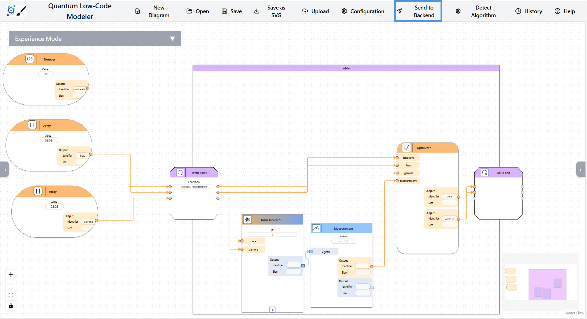
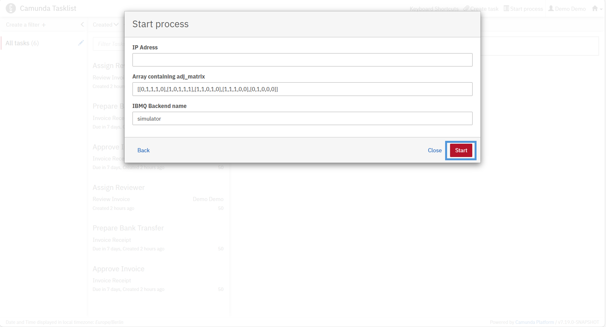
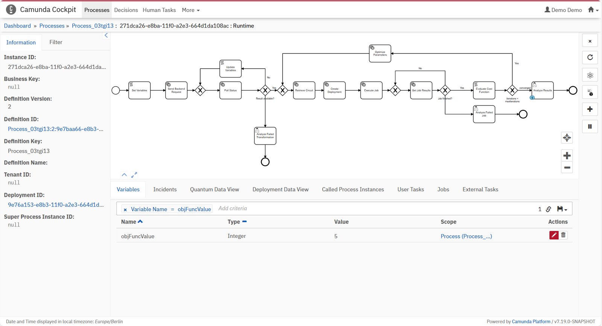

# Quantics 2026

This repository accompanies the Quantics 2026 paper and provides a research prototype of the **Multi-Domain Quantum Low-Code Modeler** together with a complete execution environment for domain-specific quantum low-code models.

The artifact demonstrates how domain experts can model optimization problems (e.g., finance) using high-level abstractions and execute the resulting hybrid quantum-classical workflows based on QAOA.

---

## Overview

The system consists of the following components:

- **Quantum Low-Code Modeler**  
  A web-based graphical modeling environment that enables users to construct quantum applications using domain-specific abstractions rather than low-level quantum circuits. It provides visual elements (domain blocks) representing tasks, constraints, and data, allowing domain experts to specify problems at a high level of abstraction.

- **Backend Transformation Service**  
  A service that automatically transforms them into executable quantum workflows.

- **Agent Context Components**  
  Supporting modules that provide runtime information required for adaptive workflow execution. These components maintain metadata, constraints, and available algorithmic options, enabling an agent to dynamically select suitable implementations during execution while ensuring semantic validity.

- **Camunda Components**  
  The workflow execution environment based on the Camunda platform. It executes the generated BPMN workflows, coordinates interactions between classical services and quantum tasks, manages process state, and provides monitoring tools such as Tasklist and Cockpit for user interaction and result inspection.

---

## 1. Start the Components

Run the following commands from the `docker` directory:

```
docker-compose pull
docker-compose up --build
```

Wait until all containers are running. This may take several minutes.

---

## 2. Start Ollama

Camunda currently only supports OpenAI Ollama models and Amazon Bedrock.
Since the execution with Amazon Bedrock can become quite expensive, we advice to use Ollama with the OpenAI model (gpt-oss:20b) if you have enough RAM (32 GB should be enough).


## 3. Open the Quantum Low-Code Modeler

Open the Quantum Low-Code Modeler at http://localhost:4242.

You should see the Modeler start screen:


Import the .

---

## 4. Import the Model

Integrate the .

After loading, the model should resemble the example shown below.


---

## 5. Transform the Model

Click "Send to Backend" to transform the domain model into an executable workflow.


---

## 6. Camunda Deployment

Open the Camunda Modeler (installed locally).

Import all files from the generated workflow folder.
This folder contains:

- BPMN workflow
- Agent context file
- Agent feedback loop file

Deploy the workflow to the Camunda engine.

---

## 7. Execute the Workflow in Camunda

Open:

http://localhost:8090

Log in using the following credentials:

```
user: demo
password: demo
```

Open the Tasklist, select the process, and enter your IP address:



Click Run.

---

## 8. View the Result

Open the Camunda Cockpit.

The result includes the objective function value. In this example, the value is:

```
```

---


## Disclaimer of Warranty
Unless required by applicable law or agreed to in writing, Licensor provides the Work (and each Contributor provides its Contributions) on an "AS IS" BASIS, WITHOUT WARRANTIES OR CONDITIONS OF ANY KIND, either express or implied, including, without limitation, any warranties or conditions of TITLE, NON-INFRINGEMENT, MERCHANTABILITY, or FITNESS FOR A PARTICULAR PURPOSE. You are solely responsible for determining the appropriateness of using or redistributing the Work and assume any risks associated with Your exercise of permissions under this License.

## Haftungsausschluss
Dies ist ein Forschungsprototyp. Die Haftung für entgangenen Gewinn, Produktionsausfall, Betriebsunterbrechung, entgangene Nutzungen, Verlust von Daten und Informationen, Finanzierungsaufwendungen sowie sonstige Vermögens- und Folgeschäden ist, außer in Fällen von grober Fahrlässigkeit, Vorsatz und Personenschäden, ausgeschlossen.
